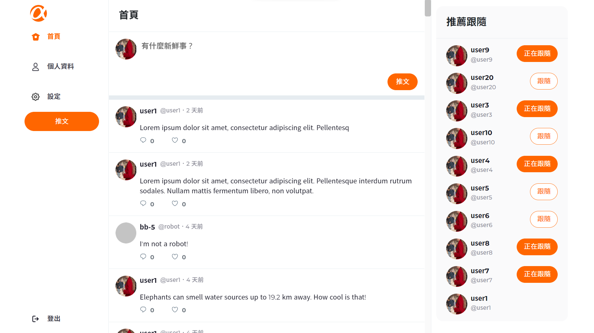

# twitter-front-end-vue


### User Feature
#### Only user can sign in front stage of this web APP!
- You can register an account to use this website
- Each account and email address are unique, not the same as any user's
- Every user's password is hashed before saving in database
- After signing in, here is what you can do :
  - Post a tweet
  - Reply to a tweet
  - Click like or unlike to any one's tweet
  - You can click like to any of your tweets
  - Follow any user but yourself
  - Unfollow any user you have followed
  - See top 10 popular users with the most followers and follow them
  - Edit your registered infromation and profile
  - See any user's profile, including how many followers, following people, posted tweets, and liked tweet
  - See any user's posted tweets ordered by the tweet-created date, from new to old
  - See any user's replies ordered by the reply-created date, from new to old
  - See any user's like tweets ordered by the like-created date, from new to old
  - See all tweets ordered by the tweet-created date, from new to old
  - See a specific tweet and it replies ordered by the reply-created date, from new to old


### Admin Feature
#### Only admin can sign in back stage of this web APP!
- Admin can sign in back stage with admin's accounts, and those accounts are not allowed to sign in front stage
- See all tweets ordered by the tweet-created date, from new to old
- See all users ordered by their number of posted tweets, from many to less
- Admin has the right to deleting any tweets

### Prerequisite
- Node.js v14.16.0

### Dependencies
#### All dependencies are listed in package.json
- expamle : package@version
- axios@0.19.2
- bootstrap@5.2.0
- core-js@3.6.5
- moment@2.24.0
- sweetalert2@9.8.2
- vue@2.6.11
- vue-router@3.5.1
- vuex@3.6.2

Development Dependencies
#### All devDependencies are listed in package.json
- @vue/cli-plugin-babel@4.1.1
- @vue/cli-plugin-eslint@4.1.1
- @vue/cli-plugin-router@5.0.8
- @vue/cli-plugin-vuex@5.0.8
- @vue/cli-service@4.1.1
- babel-eslint@10.1.0
- eslint@6.7.2
- eslint-plugin-vue@6.2.2
- node-sass@5.0.0
- sass-loader@10.1.1
- vue-template-compiler@2.6.11

### Project setup
```
npm install
```

#### Compiles and hot-reloads for development
```
npm run serve
```

#### Compiles and minifies for production
```
npm run build
```

#### Lints and fixes files
```
npm run lint
```

### Customize configuration
See [Configuration Reference](https://cli.vuejs.org/config/).
